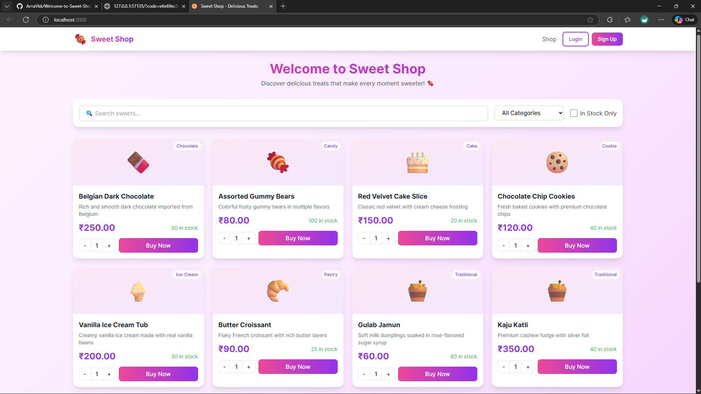
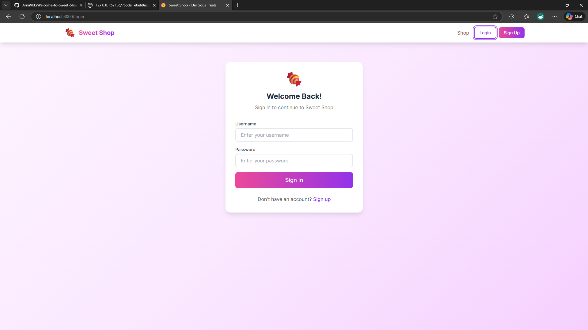
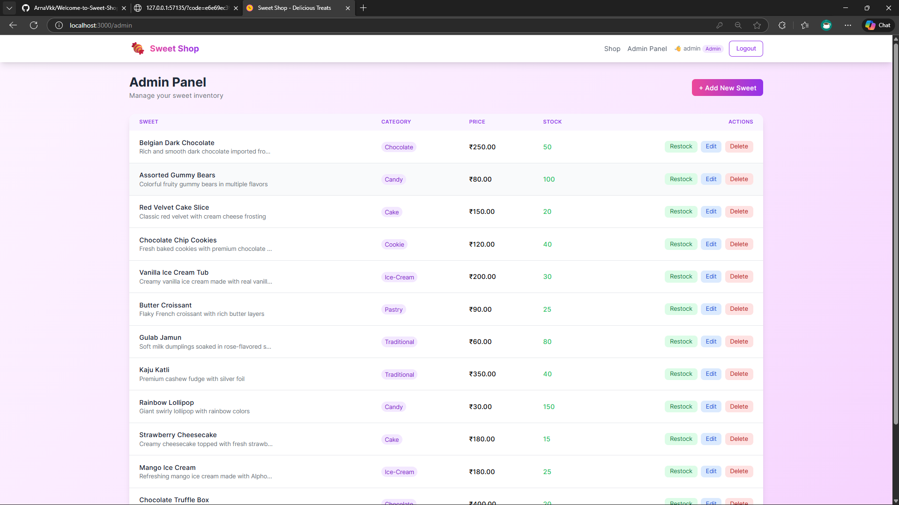
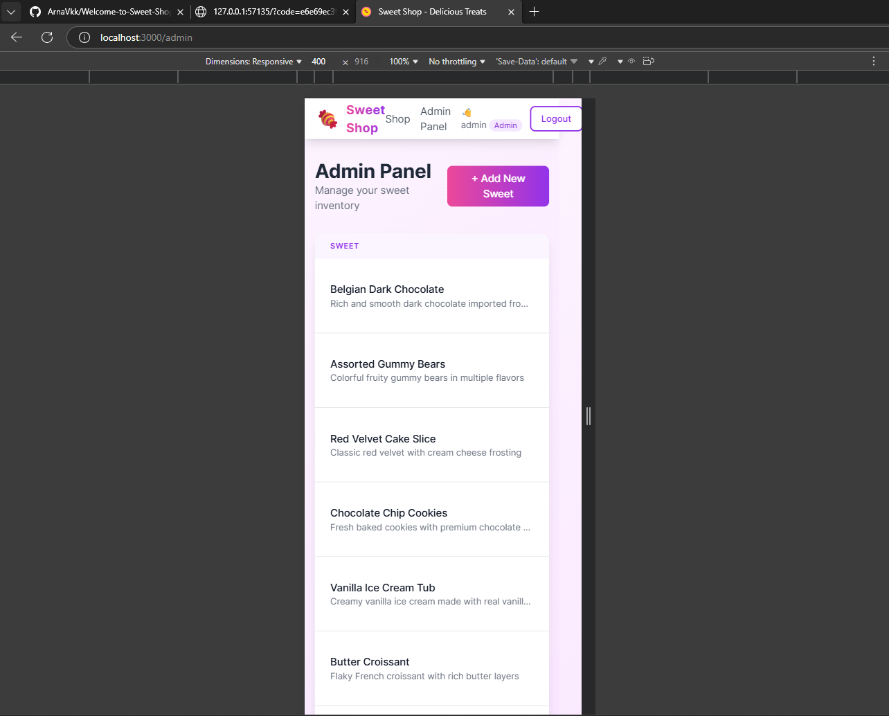

# Sweet Shop Management System 🍬

A full-stack web application for managing a sweet shop with user authentication, inventory management, and shopping functionality. Built with the MERN stack (MongoDB, Express.js, React, Node.js).

---

## 📸 Screenshots

### Dashboard (Home Page)

*Browse sweets with search and filter functionality*

### Login Page

*User authentication with JWT*

### Admin Panel

*Manage inventory - Add, Edit, Delete, and Restock sweets*

### Mobile Responsive View

*Fully responsive design for mobile devices*

> **📷 To add screenshots**: Create a `screenshots/` folder and add images named `dashboard.png`, `login.png`, `admin-panel.png`, `mobile-view.png`

---

## 🚀 Features

### For Customers (Users)
- 🔐 User registration and authentication
- 🔍 Browse sweets with search and filter options
- 🛒 Purchase sweets (stock decrements automatically)
- 📱 Responsive design for mobile and desktop

### For Administrators
- ➕ Add new sweets to inventory
- ✏️ Edit existing sweet details
- 🗑️ Delete sweets from catalog
- 📦 Restock items when quantity is low
- 📊 View inventory statistics

### Technical Features
- JWT-based authentication with role-based access control
- RESTful API with proper error handling
- TDD approach with comprehensive test coverage (35 tests)
- MongoDB with Mongoose ODM
- React SPA with Context API for state management

---

## 🛠️ Tech Stack

### Backend
| Technology | Purpose |
|------------|---------|
| Node.js | Runtime environment |
| Express.js | Web framework |
| MongoDB | NoSQL database |
| Mongoose | ODM for MongoDB |
| JWT | Authentication tokens |
| bcryptjs | Password hashing |
| express-validator | Input validation |
| Jest + Supertest | Testing framework |

### Frontend
| Technology | Purpose |
|------------|---------|
| React 18 | UI library |
| Vite | Build tool |
| React Router v6 | Client-side routing |
| Tailwind CSS | Styling |
| Axios | HTTP client |
| react-hot-toast | Notifications |

---

## 📁 Project Structure

```
sweet-shop-management/
├── README.md                    # Project documentation
├── TEST_REPORT.txt              # Test results with coverage
├── .gitignore
│
├── backend/
│   ├── package.json
│   ├── .env.example             # Environment template
│   └── src/
│       ├── server.js            # Entry point
│       ├── app.js               # Express app setup
│       ├── seed.js              # Database seeder
│       ├── config/
│       │   └── database.js      # MongoDB connection
│       ├── models/
│       │   ├── User.js          # User schema
│       │   └── Sweet.js         # Sweet schema
│       ├── controllers/
│       │   ├── auth.controller.js
│       │   └── sweet.controller.js
│       ├── middleware/
│       │   └── auth.middleware.js
│       └── routes/
│           ├── auth.routes.js
│           └── sweet.routes.js
│   └── tests/
│       ├── setup.js             # Test configuration
│       └── api/
│           ├── auth.test.js     # Auth API tests
│           └── sweets.test.js   # Sweets API tests
│
├── frontend/
│   ├── package.json
│   ├── vite.config.js
│   ├── tailwind.config.js
│   ├── index.html
│   └── src/
│       ├── main.jsx             # Entry point
│       ├── App.jsx              # Main app with routing
│       ├── index.css            # Tailwind styles
│       ├── context/
│       │   └── AuthContext.jsx  # Authentication state
│       ├── services/
│       │   └── api.js           # API client
│       ├── components/
│       │   ├── Navbar.jsx
│       │   ├── Loading.jsx
│       │   └── SweetCard.jsx
│       └── pages/
│           ├── Dashboard.jsx
│           ├── Login.jsx
│           ├── Register.jsx
│           └── AdminPanel.jsx
│
└── screenshots/                 # Add your screenshots here
```

---

## 🏃‍♂️ Installation & Setup

### Prerequisites
- **Node.js** v18+ ([Download](https://nodejs.org))
- **MongoDB** (local installation or [MongoDB Atlas](https://mongodb.com/atlas))
- **Git** ([Download](https://git-scm.com))

### Step 1: Clone the Repository
```bash
git clone https://github.com/YOUR_USERNAME/sweet-shop-management.git
cd sweet-shop-management
```

### Step 2: Backend Setup
```bash
cd backend

# Install dependencies
npm install

# Create environment file
cp .env.example .env

# Edit .env with your configuration:
# MONGODB_URI=mongodb://localhost:27017/sweet-shop
# JWT_SECRET=your-super-secret-key
# PORT=5000
```

### Step 3: Start MongoDB
```bash
# If using local MongoDB (Windows):
"C:\Program Files\MongoDB\Server\8.2\bin\mongod.exe" --dbpath "C:\data\db"

# Or use MongoDB Atlas (cloud) - update MONGODB_URI in .env
```

### Step 4: Seed the Database
```bash
cd backend
node src/seed.js
```
This creates:
- Admin user: `admin` / `admin123`
- Regular user: `user` / `user123`
- 12 sample sweets

### Step 5: Start Backend Server
```bash
cd backend
npm run dev
# Server runs on http://localhost:5000
```

### Step 6: Frontend Setup (New Terminal)
```bash
cd frontend

# Install dependencies
npm install

# Start development server
npm run dev
# Frontend runs on http://localhost:3000
```

### Step 7: Open the Application
Navigate to **http://localhost:3000** in your browser.

---

## 🧪 Running Tests

### Run All Tests with Coverage
```bash
cd backend
npm test
```

### Test Results Summary
```
Test Suites: 2 passed, 2 total
Tests:       35 passed, 35 total
Coverage:    ~70% statements, ~77% functions
```

See `TEST_REPORT.txt` for detailed test output.

### Test Categories
| Category | Tests | Description |
|----------|-------|-------------|
| Auth API | 11 | Register, Login, Profile |
| Sweets CRUD | 12 | Create, Read, Update, Delete |
| Purchase/Restock | 7 | Business logic |
| Authorization | 5 | Role-based access control |

---

## 📝 API Documentation

### Base URL
```
http://localhost:5000/api
```

### Authentication Endpoints

| Method | Endpoint | Description | Access |
|--------|----------|-------------|--------|
| POST | `/auth/register` | Register new user | Public |
| POST | `/auth/login` | Login user | Public |
| GET | `/auth/me` | Get current user profile | Private |

### Sweet Endpoints

| Method | Endpoint | Description | Access |
|--------|----------|-------------|--------|
| GET | `/sweets` | Get all sweets (with filters) | Public |
| GET | `/sweets/:id` | Get sweet by ID | Public |
| POST | `/sweets` | Create new sweet | Admin |
| PUT | `/sweets/:id` | Update sweet | Admin |
| DELETE | `/sweets/:id` | Delete sweet | Admin |
| POST | `/sweets/:id/purchase` | Purchase sweet | Private |
| POST | `/sweets/:id/restock` | Restock sweet | Admin |

### Query Parameters (GET /sweets)
- `search` - Search by name/description
- `category` - Filter by category (chocolate, candy, cake, etc.)
- `inStock` - Filter by stock status (true/false)
- `sortBy` - Sort field (name, price, quantity)
- `order` - Sort order (asc/desc)

### Error Codes
| Code | Meaning |
|------|---------|
| 400 | Bad Request (validation error) |
| 401 | Unauthorized (missing/invalid token) |
| 403 | Forbidden (admin required) |
| 404 | Not Found |

### Example API Calls

**Register a new user:**
```bash
curl -X POST http://localhost:5000/api/auth/register \
  -H "Content-Type: application/json" \
  -d '{"username": "newuser", "password": "password123"}'
```

**Login:**
```bash
curl -X POST http://localhost:5000/api/auth/login \
  -H "Content-Type: application/json" \
  -d '{"username": "admin", "password": "admin123"}'
```

**Get all sweets:**
```bash
curl http://localhost:5000/api/sweets
```

**Create a sweet (admin):**
```bash
curl -X POST http://localhost:5000/api/sweets \
  -H "Content-Type: application/json" \
  -H "Authorization: Bearer YOUR_TOKEN" \
  -d '{"name": "New Sweet", "category": "candy", "price": 50, "quantity": 100}'
```

---

## 🤖 My AI Usage

> This section documents how AI tools were used during the development of this project, as required by the placement evaluation guidelines.

### AI Tools Used
- **GitHub Copilot** (Primary tool for code generation and assistance)

### Detailed Usage Log

#### Phase 1: Project Setup & Architecture
| Task | AI Contribution | My Contribution |
|------|-----------------|-----------------|
| Project folder structure | Generated initial boilerplate | Customized for MERN stack requirements |
| package.json files | Suggested dependencies | Selected specific versions, added scripts |
| Database schema design | Generated Mongoose schema templates | Added validations, indexes, virtual fields |
| Environment configuration | Suggested .env structure | Configured for local and production |

#### Phase 2: Backend Development
| Task | AI Contribution | My Contribution |
|------|-----------------|-----------------|
| Express app setup | Generated middleware chain | Added custom error handling |
| User model with bcrypt | Provided hashing pattern | Implemented password comparison method |
| JWT authentication | Generated token signing/verification | Added expiration, error handling |
| Auth middleware | Suggested bearer token pattern | Added role-based authorization |
| CRUD controllers | Generated RESTful patterns | Implemented business logic (purchase, restock) |
| Input validation | Suggested express-validator usage | Defined validation rules per endpoint |
| Route definitions | Generated route templates | Applied middleware guards |

#### Phase 3: Testing (TDD)
| Task | AI Contribution | My Contribution |
|------|-----------------|-----------------|
| Jest + Supertest setup | Generated test configuration | Set up mongodb-memory-server |
| Auth test cases | Suggested test structure | Added edge cases (duplicate user, wrong password) |
| CRUD test cases | Generated basic CRUD tests | Added authorization tests (403 for non-admin) |
| Business logic tests | Suggested test scenarios | Tested insufficient stock, restock logic |

#### Phase 4: Frontend Development
| Task | AI Contribution | My Contribution |
|------|-----------------|-----------------|
| React component structure | Generated component templates | Designed UI/UX flow |
| AuthContext | Suggested Context API pattern | Implemented login/logout persistence |
| API service layer | Generated axios interceptors | Added token refresh, error handling |
| Dashboard page | Generated card layout | Added search, filter, responsive grid |
| Admin panel | Suggested table + modal pattern | Implemented CRUD operations, restock |
| Tailwind styling | Generated utility classes | Created custom candy-themed color palette |

#### Phase 5: Documentation
| Task | AI Contribution | My Contribution |
|------|-----------------|-----------------|
| README structure | Suggested sections | Wrote project-specific content |
| API documentation | Generated endpoint tables | Added examples and error codes |
| Setup instructions | Suggested command format | Tested and verified each step |

### Reflection on AI Usage

#### What Worked Well
1. **Boilerplate Generation**: AI significantly reduced time spent on repetitive setup code (Express routes, React components, test structures).
2. **Pattern Suggestions**: Copilot suggested industry-standard patterns for JWT auth, Context API, and RESTful design.
3. **Test Case Ideas**: AI helped identify edge cases I might have missed (e.g., testing 403 vs 401 responses).
4. **Documentation**: AI helped structure comprehensive documentation quickly.

#### What Required Human Judgment
1. **Business Logic**: The purchase flow (check stock → decrement → save) required careful thought about race conditions and validation.
2. **Security Decisions**: Chose bcrypt rounds, JWT expiration, and which routes need admin access.
3. **UX Decisions**: Decided on user flows, error messages, and when to show/hide UI elements.
4. **Architecture Choices**: Selected React Context over Redux, chose Tailwind over other CSS frameworks.

#### What I Learned
1. AI tools are excellent for **accelerating** development but require **active review** for security-sensitive code.
2. Writing clear prompts leads to better AI suggestions - specificity matters.
3. AI-generated code often needs **refactoring** to fit the specific project context.
4. The TDD workflow (Red-Green-Refactor) was enhanced by AI generating initial test structures, but **assertions and edge cases** required human expertise.

#### Responsible AI Usage
- All AI-generated code was **reviewed** before committing.
- Security-critical code (password hashing, JWT verification) was **manually verified**.
- AI suggestions were treated as **starting points**, not final solutions.
- This documentation provides **full transparency** about AI assistance.

### Commit Co-authorship Format Used
```
feat: Add sweet purchase functionality

Implemented stock validation and atomic decrement.
Used GitHub Copilot for controller boilerplate.

Co-authored-by: GitHub Copilot
```

---

## 🚀 Deployment (Optional - Brownie Points)

### Backend Deployment (Render/Railway)
1. Create account on [Render](https://render.com) or [Railway](https://railway.app)
2. Connect your GitHub repository
3. Set environment variables:
   - `MONGODB_URI` (use MongoDB Atlas connection string)
   - `JWT_SECRET`
   - `NODE_ENV=production`
4. Build command: `npm install`
5. Start command: `npm start`

### Frontend Deployment (Vercel/Netlify)
1. Create account on [Vercel](https://vercel.com) or [Netlify](https://netlify.com)
2. Connect your GitHub repository
3. Configure:
   - Build command: `npm run build`
   - Output directory: `dist`
   - Set `VITE_API_URL` environment variable to your backend URL

### Database (MongoDB Atlas)
1. Create free cluster at [mongodb.com/atlas](https://mongodb.com/atlas)
2. Create database user
3. Add IP `0.0.0.0/0` to network access (for deployment)
4. Get connection string and add to backend `.env`

---

## 📋 Development Checklist

- [x] Project initialization with Git
- [x] Backend Express server setup
- [x] MongoDB connection with Mongoose
- [x] User authentication (register/login)
- [x] JWT middleware for protected routes
- [x] Role-based access control (admin/user)
- [x] Sweet CRUD operations
- [x] Purchase flow with stock management
- [x] Restock functionality (admin only)
- [x] Input validation on all endpoints
- [x] Comprehensive API tests (35 tests)
- [x] React frontend with Vite
- [x] Authentication UI (login/register)
- [x] Dashboard with search and filters
- [x] Admin panel with inventory management
- [x] Responsive design with Tailwind CSS
- [x] Error handling and loading states
- [x] API documentation
- [x] AI usage documentation
- [ ] Screenshots (add after running the app)
- [ ] Deployment to cloud platform

---

## 👨‍💻 Author

**Arnav Kumar**
- Final Year CSE Student
- Placement Project Submission - December 2024

---

## 📄 License

This project is created for educational purposes as part of a placement evaluation process.

---

## 🙏 Acknowledgments

- [Express.js](https://expressjs.com) - Backend framework
- [React](https://react.dev) - Frontend library
- [MongoDB](https://mongodb.com) - Database
- [Tailwind CSS](https://tailwindcss.com) - Styling
- [GitHub Copilot](https://github.com/features/copilot) - AI assistance (documented above)
